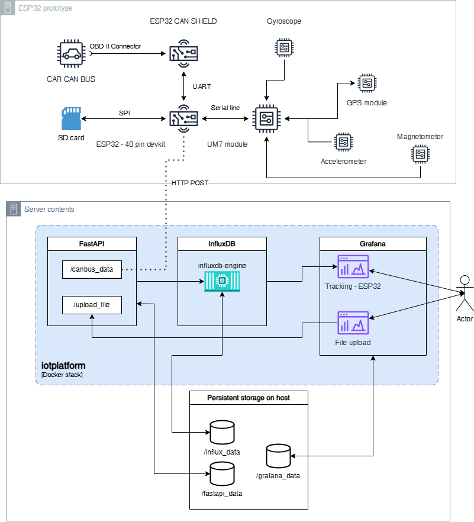

# Vehicle Position and Operational Data Logger

This repository contains a complete solution for recording, storing, and visualizing the position and operational data of vehicles such as cars, trams, or trains. The system consists of an embedded ESP32-based device, a backend server stack, and a web interface.

## 🚀 Overview

The system includes:
- **ESP32 device**
  - **ESP32-based firmware** that gathers data from:
    - **UM7 orientation sensor** (accelerometer, gyroscope, GPS)
    - **Vehicle CAN bus** via OBD-II
  - **Local storage** of data (offline mode) and **real-time streaming** (online mode)
- **Server backend** using InfluxDB and FastAPI
  - **Visualization dashboards** using Grafana

## 🧱 Project Structure

```
.
├── README.md                  # Project overview and usage instructions
├── dp.drawio.png              # System architecture diagram
├── vpp_project.vpp            # UML diagrams and system design (Visual Paradigm)

├── esp32fw/                   # Embedded firmware for ESP32 (PlatformIO)
│   ├── src/                   # Main source code (sensor handling, CAN, logging)
│   ├── lib/                   # Firmware libraries (UM7, CAN, config parser)
│   ├── test/                  # Unit tests and integration tests
│   ├── docs/                  # Auto-generated documentation (Doxygen)
│   ├── config.txt             # Runtime configuration file (e.g. sampling rate, server)
│   ├── platformio.ini         # Build system configuration (PlatformIO)
│   └── Doxyfile               # Documentation build config

├── iotplatform/              # Backend services (data collection, visualization)
│   ├── fastapi_app/           # REST API for data ingestion and processing
│   ├── codec8e-parser-tcp-server/  # Raw TCP server for decoding telemetry
│   ├── configurations/        # App and Grafana configuration files
│   ├── influx_data/           # Persistent storage for InfluxDB
│   ├── grafana_data/          # Grafana dashboards and user settings
│   ├── fastapi_data/          # App-level runtime data (e.g., logs, uploads)
│   ├── docker-compose.yml     # Multi-container setup for the full backend stack
│   └── venv/                  # Python virtual environment (optional, for local dev)
```

## 🔧 Getting Started

### Firmware (ESP32)

> Built using [PlatformIO](https://platformio.org/) in Visual Studio Code.

1. Connect your ESP32 board via USB.
2. Navigate to `esp32fw` folder.
3. Build and upload the firmware:
   ```bash
   pio run --target upload
   ```

4. Optional: Monitor serial output
   ```bash
   pio device monitor
   ```

### Configuration

Edit `esp32fw/config.txt` to customize:
- Server URL
- Logging interval
- Enabled sensors (GPS, CAN, etc.)

### Backend & Web App

> [Docker](https://www.docker.com/) is required.

1. Navigate to the `iotplatform` folder:
   ```bash
   cd iotplatform
   ```

2. Launch the backend stack:
   ```bash
   docker-compose up --build
   ```

3. Access services:
   - **FastAPI**: [http://localhost:8000](http://localhost:8000)
   - **Grafana**: [http://localhost:3000](http://localhost:3000)

## 📈 Data Flow

1. ESP32 gathers data from sensors.
2. Data is stored locally and/or streamed to the backend.
3. FastAPI receives and stores data in InfluxDB.
4. Grafana visualizes data in dashboards.



## 🛠 Technologies Used

- **ESP32**
- **UM7 Sensor**
- **CAN Bus / OBD-II**
- **FastAPI**
- **InfluxDB**
- **Grafana**
- **Docker & Docker Compose**
- **PlatformIO**

## 📚 Documentation

- Sensor protocol specs: [`esp32fw/docs/`](esp32fw/docs/)
- Configuration sample: [`esp32fw/config.txt`](esp32fw/config.txt)
- UML & architecture: `vpp_project.vpp`, `dp.drawio.png`

## 🔮 Possible Future Improvements

- Advanced filtering and analytics on device
- Vehicle behavior anomaly detection

K
## 👤 Author

Created by **Vojtěch Giesl** as part of his 2025 Master's Thesis at [VŠB – Technical University of Ostrava](https://www.fei.vsb.cz/cs).

## 📄 License

MIT License – see [`LICENSE`](LICENSE) file.

---

> ⚠️ _This README was generated with the assistance of AI (ChatGPT) based on the contents of the accompanying master's thesis._
